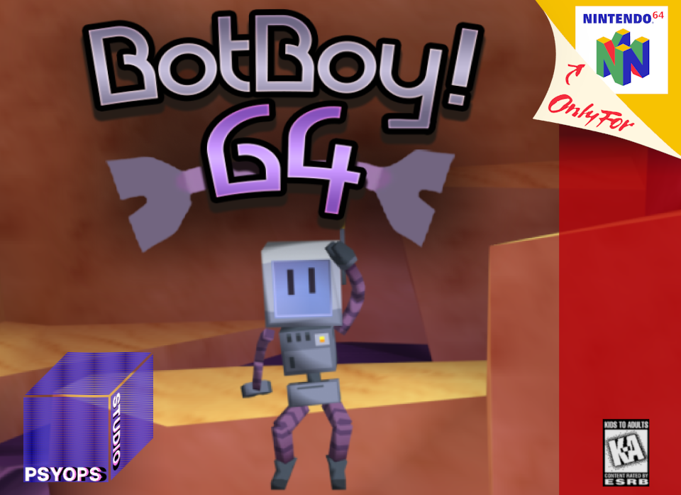

  

# BotBoy!64

A 3D platformer for the Nintendo 64, created for N64brew Game Jam 2025.

## Story

You follow BotBoy on a quest to fix up the abandoned strip mine which has been run down by rogue AI. In the process, BotBoy damages himself and loses limbs in a fall, forcing him to traverse across a hostile world to find his missing body parts in order to continue on his journey.

Guide what remains of BotBoy through poison fields, mesmerizing caves, sky-high fortresses, and molten lava pits as he literally puts himself back together.

**Can you help BotBoy repair himself?**

## Collectibles

- **Bolts** are scattered throughout every level—some in plain sight, others deviously hidden.
- **Golden Screws** are the ultimate prize for completionists.

## Features

- 3 distinct playstyles (Torso, Arms, Fullbody) that distinctly change the game
- Expansive soundtrack in multiple genres
- Dynamic lighting system implemented on some levels
- Checkpoint systems to ease frustrations
- Puzzle mechanics (Buttons, activation triggers, moving platforms)
- 6 fully featured levels
- Music Jukebox with Party Mode
- Ranked and timed level playthroughs
- 3 save slots
- Cutscenes
- Combat against enemy AI
- Multiplayer split screen
- A grand secret reserved only for those who 100% the game and collect every item

## Controls

### Universal
| Action | Button |
|--------|--------|
| Wall Jump | Press A on wall |
| Camera Distance | C-Up / C-Down |

### Torso Mode
| Action | Button |
|--------|--------|
| Charge Jump | Hold A (single, double, triple jump with different arc colors) |
| Tap Hop | Tap A |

### Arms Mode
| Action | Button |
|--------|--------|
| Jump | A |
| Spin Attack | B |
| Hover | Spin attack in air |

### Fullbody Mode
| Action | Button |
|--------|--------|
| Jump | A |
| Crouch | Z |
| Kick Attack | Z + C-Left |
| Long Jump | Run + Hold Z + Jump |
| Hover Jump | Stand still + Hold Z + Jump |

## Cheats

*Only usable in main menu*

| Cheat | Code |
|-------|------|
| Giant Mode | C-Up, C-Up, C-Down, C-Down, A |
| Tiny Mode | C-Down, C-Down, C-Up, C-Up, B |
| Debug Mode | Up, Up, Down, Down, Left, Right, Left, Right, B, A |

## Requirements

- Nintendo 64 Expansion Pak (8MB RAM)

## Credits

| Role | Name |
|------|------|
| Engine/Graphics Programming/Enemy AI | Cypress |
| Enemy AI/Player Controls | Nupi |
| Sound Designer/Composer | DakodaComposer |
| Lead Art Designer/Map Designer/3D Modeler/3D Animator | DC.all |
| Concept Art/Character Design | Statyc Tyr |

---

*Created for N64brew Game Jam 2025*
